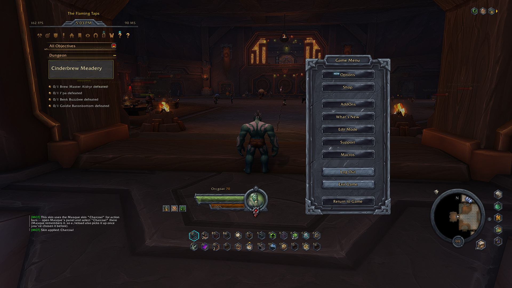
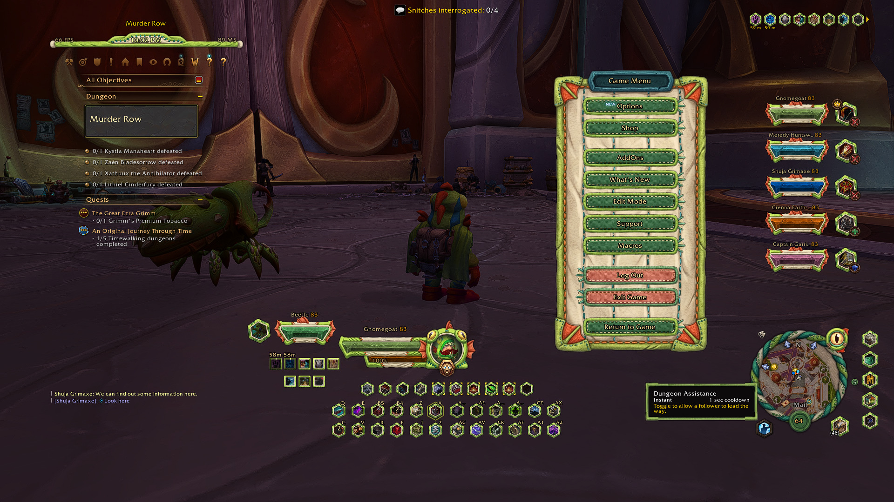
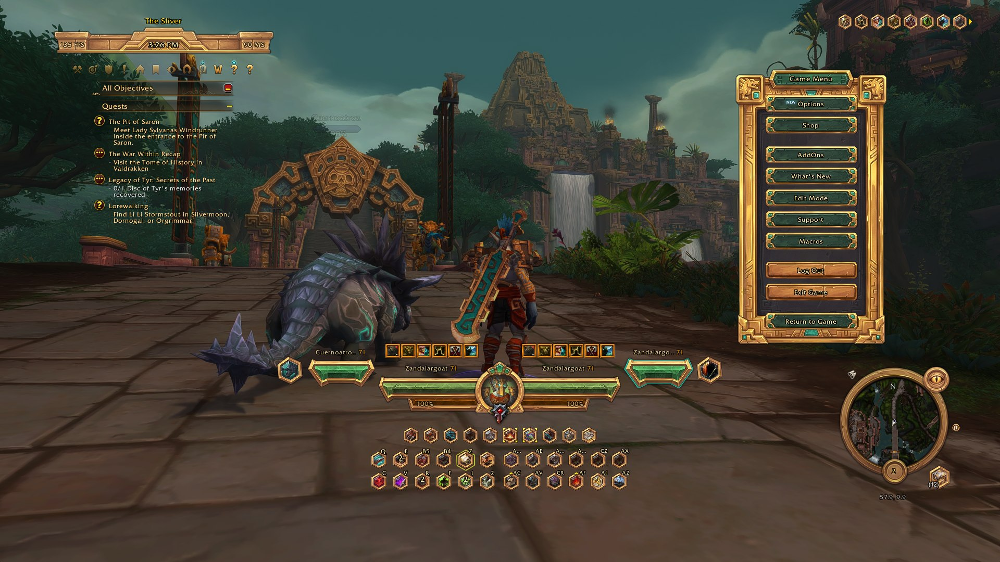

# MyCustomFrames — Skins

Skins for **[MyCustomFrames](https://github.com/Gonkast/MyCustomFrames)** (the "Gonkast Preset" HUD
for World of Warcraft Midnight). All skins live in this single repository instead of one repo each.

## Requirements

- **MyCustomFrames** — hard dependency (`## RequiredDeps`); a skin does nothing on its own.
- **Masque** (optional) — each skin also ships its own Masque skin for action buttons.

## Installation

> **The single most common mistake:** copying the downloaded folder itself. Don't — you have to
> copy the skin folders that are *inside* it. See step 3.

1. Install **[MyCustomFrames](https://github.com/Gonkast/MyCustomFrames)** first. A skin is not a
   standalone addon; without it, nothing shows up in your AddOns list at all.
2. **Code → Download ZIP** above, then extract it. You'll get a folder called
   `MyCustomFrames-Skins-main`.
3. Open that folder. Inside are the skin folders (`MyCustomFrames_Charcoal`,
   `MyCustomFrames_Murloc`, …). Copy **those** into
   `World of Warcraft\_retail_\Interface\AddOns\` — *not* `MyCustomFrames-Skins-main` itself,
   and not the `README.md`. Copy as many or as few as you want.
4. **Don't rename them.** Each folder name has to match the `.toc` inside it exactly, or WoW
   ignores it.
5. Restart WoW (or reload the AddOns list at the character screen).
6. Log in and pick one from **MyCustomFrames' options panel → Skins**.

When it's right, `Interface\AddOns\` looks like this:

```
Interface\AddOns\
├── MyCustomFrames\             <- the main addon (required)
├── MyCustomFrames_Charcoal\    <- a skin
└── MyCustomFrames_Murloc\      <- another skin
```

Each skin is its own addon, so it appears as a toggleable sub-entry under MyCustomFrames in the
AddOns list, with the skin's own icon — leave the ones you don't use disabled.

**A skin folder is not a replacement for the main addon.** It only supplies textures; installing a
skin *instead of* MyCustomFrames does nothing.

## Included skins

| Skin | Folder |
|---|---|
| Charcoal | `MyCustomFrames_Charcoal\` |
| Murloc | `MyCustomFrames_Murloc\` |
| Zandalari | `MyCustomFrames_Zandalari\` |

## Previews

### Charcoal



### Murloc



### Zandalari



## Repository layout

This repo is versioned **from the `Interface\AddOns\` folder itself**, with a `.gitignore` that
ignores everything and re-includes only the `MyCustomFrames_<Skin>` folders. That's deliberate:
WoW reads one `.toc` per folder, so a skin has to be its own addon folder to get its own checkbox
and icon in the AddOns list — they can't be subfolders of a single container addon.

Your other addons (including MyCustomFrames itself, which has its own repo) are ignored here.

## Creating a new skin

1. Copy `MyCustomFrames_Charcoal\` and rename it to `MyCustomFrames_<Skin>`.
2. Rename the `.toc` inside to match the folder name exactly, and update its `## Title` and
   `## IconTexture` path.
3. In `Load.lua`, three things must match the new name:
   - `BASE` → `Interface\\AddOns\\MyCustomFrames_<Skin>\\Assets\\`
   - `MCF_RegisterSkin("<Skin>", BASE, "<Skin>")`
   - `SKIN_NAME = "<Skin>"`
4. Add `!/MyCustomFrames_<Skin>/` to `.gitignore`.
5. Replace the textures in its `Assets\` folder.
6. Add it to the table above, and drop a screenshot in `Screenshots\` with a row under Previews.

Note that only `MasqueSkin\actionbutton-border.tga` is skin-specific — the mask, backdrop, glow
and pushed textures are shared across all skins, so copying them across is intended, not an
oversight.

## What a skin must contain

A skin's `Assets\` folder **must ship all 25 skinnable textures plus a complete `MasqueSkin\`
subfolder.** Keep the filenames byte-identical to the originals.

There is no per-file fallback: a texture that belongs to the skinnable list but is missing from the
skin folder renders **invisible**. WoW's Lua cannot check whether a file exists —
`Texture:SetTexture()` returns `true` for missing files too, so it can't be used to detect this.

Anything *not* on that list always comes from the main addon's own `Assets\`, no matter what the
skin folder contains — so there's no point adding extra files.

The authoritative list is the `SKINNABLE` whitelist in MyCustomFrames' `core.lua` (also documented
in its `STRUCTURE.md`, section "Assets locales"):

```
actionbutton-border square.tga   hp_low_case_mirror.tga      minimap-mask-opaque.tga
actionbutton-border.tga          hp_low_case_mirror_b.tga    minimap-mask-transparent.tga
Background border.tga            hp_party_cage.tga           minimap-onebar-backdrop.tga
border-tooltip.tga               hp_pet_cage.tga             orb_case_low.tga
button red2 large.tga            icon_exit_flight.tga        point_diamond.tga
button wood large.tga            info_bg.tga                 point_plate.tga
cast_back.tga                    minimap-border.tga          portrait_frame_lo.tga
group-finder-eye-orange.tga      hp_low_case.tga             power_low_case_s.tga
hp_low_case_miror_s.tga
```

> Two of the original filenames are misspelled (`hp_low_case_miror_s.tga` with one `r`,
> `portrait_frame_lo.tga` truncated). Copy them exactly as-is.

`group-finder-eye-orange.tga` doubles as the skin's icon in the AddOns list.

The two `minimap-mask-*` textures define the minimap's **clipped shape**, not just its look — a
malformed mask breaks the whole minimap, so edit those two carefully.

`MasqueSkin\` needs: `actionbutton-backdrop.tga`, `actionbutton-border.tga`,
`actionbutton-glow-white.tga`, `actionbutton-pushed.tga`, `actionbutton_circular_mask.tga`.

## Credits

Skins by **Gonkast**. Base textures derived from AzeriteUI.
